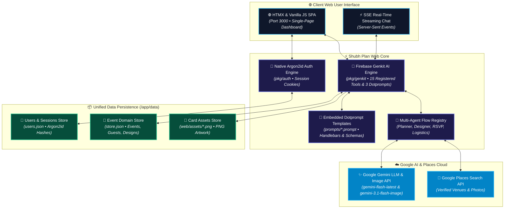

# ✨ Shubh Plan Web — AI Event Operating System & Bespoke Invitation Studio

<div align="center">

[](https://go.dev)
[](https://firebase.google.com/docs/genkit-go)
[](pkg/auth)
[](https://htmx.org)
[](fly.toml)
[](LICENSE)

**Shubh Plan Web is an all-in-one AI-native event planning workspace and generative invitation studio. It empowers event planners and hosts to design high-resolution invitation artwork, verify venue details with Google Maps, manage guest RSVPs and dietary needs, and coordinate ceremony schedules in real time.**

[Quickstart](#-quickstart) • [Architecture](#-architecture) • [Feature Capabilities](#-feature-capabilities) • [Operating Modes](#-operating-modes--byok) • [Data Persistence](#-unified-data-persistence) • [Deployment Guide](DEPLOYMENT.md) • [Environment Setup](#%EF%B8%8F-environment-configuration)

> 🌐 **Live Web Demo**: [https://shubh-plan-demo.fly.dev](https://shubh-plan-demo.fly.dev)  
> 🔑 **Pre-seeded Admin Account**: `admin@shubhplan.ai` / `shubh2026` (Argon2id Auth)  
> ⚡ **Demo Key Setup**: Bring Your Own Gemini API Key (BYOK) via top-bar settings modal or 1-click Instant Guest Demo.

</div>

---



---

## ⚡ Quickstart

### Option A: Standard Application Run
Launch **Shubh Plan Web** locally in one command:

```bash
cd apps/shubh-plan-web

# Run the local web server
go run main.go
```

Open your browser and navigate to:
- 🌐 **Web Interface**: [`http://localhost:3000`](http://localhost:3000)
- 🔍 **Healthcheck Endpoint**: [`http://localhost:3000/api/health`](http://localhost:3000/api/health)

### Option B: Genkit Developer UI & Trace Playground
To inspect execution traces, test `.prompt` templates interactively, and evaluate LLM tool calls:

```bash
cd apps/shubh-plan-web

# Run with Genkit Developer UI
genkit start -- go run .
```

Open your browser and navigate to:
- 🛠️ **Genkit Dev UI**: [`http://localhost:4000`](http://localhost:4000)
- 📜 **Prompt Playground**: [`http://localhost:4000/prompts`](http://localhost:4000/prompts)

---

## ✨ Feature Capabilities

### 📜 1. Genkit Dotprompt Templating System (`prompts/`)
- **Embedded Prompt Templates**: Decouples prompt engineering from Go source code into external `.prompt` files embedded in the binary via `//go:embed prompts/*.prompt`.
- **`event_assistant.prompt`**: Core conversational system prompt with Handlebars dynamic context (`{{title}}`, `{{venue}}`), security mandates, slash command instructions, and tool bindings.
- **`invitation_suggestions.prompt`**: Synthesizes 4 distinct invitation artwork prompt suggestions with structured JSON output formatting.
- **`invitation_artwork.prompt`**: Compiles luxury visual invitation card artwork generation prompts.

### 🛠️ 2. 15 Domain Genkit Tools (`pkg/genkit/tools.go`)
Agents and Flows can invoke 15 domain execution tools:
- **Event Logistics**: `getEventDetails`, `updateEventDetails`, `searchVenueInfo` (Google Maps Places API).
- **Guest Roster**: `listGuests`, `addOrUpdateGuest`, `deleteGuest`, `toggleGuestRSVP`.
- **Itinerary & Schedule**: `listItinerary`, `addItineraryItem`.
- **Invitation Design Studio**: `createInvitationSpec`, `listDesigns`, `deleteDesign`, `generateInvitationImage` (`gemini-3.1-flash-image`).
- **Workspace Administration**: `exportEventData` (JSON export), `resetEventWorkspace` (Store wipe).

### 🔐 3. Dual Operating Modes & Bring Your Own Key (BYOK)
- **Demo Mode (`APP_MODE=demo`)**: Tailored for public cloud deployments (e.g. Fly.io). Users provide their own free Gemini API key and optional Google Maps Places API key in a top-bar settings modal (stored strictly in browser `localStorage`). Includes 1-click **Instant Guest Demo**.
- **Server Mode (`APP_MODE=server`)**: Designed for local or private server usage. Automatically loads system environment variables (`GEMINI_API_KEY`, `GOOGLE_MAPS_API_KEY`) from `.env`.

### 👤 4. Native Argon2id Authentication
- **Enterprise-Grade Hashing**: Uses Argon2id password hashing (`$argon2id$...` with salt & key derivation) matching `apps/shubh-plan-open`.
- **Session Security**: Supports `admin`, `planner`, and `guest` roles with secure `shubh_session` HTTP cookies and `X-Session-ID` headers.

### 🎨 5. Bespoke AI Invitation Studio
- **Dynamic Aspect Ratios**: Design in `9:16` vertical poster, `4:5` portrait, `1:1` square, or `16:9` landscape.
- **7 Signature Aesthetic Presets**: Choose from *South Indian*, *Paper Cut 3D*, *Clay 3D*, *Pop Art*, *Mughal*, *Minimalist Gold*, and *Watercolor*.
- **High-Res PNG Card Rendering**: Renders full-resolution `.png` card artwork with 1-click download and clipboard prompt copying.

### 🤖 6. AI Event Assistant, Slash Commands & Component Widgets
- **Conversational Setup & Real-Time SSE**: Real-time Server-Sent Events (SSE) chat for natural conversation setup with real-time `⏳ Thinking...` loading states.
- **Interactive Quick Action Chips & Slash Commands (`/`)**: Trigger quick actions (`/summarize`, `/add-guests`, `/schedule`, `/generate-invitation`) via top chips or floating backdrop-blur autocomplete menu.
- **Modular In-Chat Component Widgets ([`web/widgets.js`](file:///c:/Users/Gokul/Documents/Programming/Antigravity/shubh-plan/apps/shubh-plan-web/web/widgets.js))**: Self-contained 1-click HTML form components embedded inside chat bubbles (`AddGuestWidget`, `GenerateInvitationWidget`, `ScheduleSessionWidget`).

---

## 📦 Unified Data Persistence

All application data is persisted in human-readable JSON files inside the data directory (`./data` locally or `/app/data` when deployed):

| Data File | Contents | File Format |
| :--- | :--- | :--- |
| `data/users.json` | User accounts, Argon2id password hashes, roles, and registration dates | POSIX `0644` JSON |
| `data/store.json` | Active event profile, guest roster, itinerary run-of-show, and generated invitation designs | POSIX `0644` JSON |
| `prompts/*.prompt` | Genkit Dotprompt templates (`event_assistant`, `invitation_suggestions`, `invitation_artwork`) | YAML + Handlebars |
| `web/widgets.js` | Modular in-chat UI component widgets (`AddGuestWidget`, `GenerateInvitationWidget`, `ScheduleSessionWidget`) | Vanilla JS Module |
| `web/assets/*.png` | High-resolution generated PNG invitation card artwork files | Binary PNG Images |

---

## ⚙️ Environment Configuration

| Variable | Default | Description |
| :--- | :--- | :--- |
| `GEMINI_API_KEY` | *(Optional)* | Server-wide Google Gemini API Key. Web users can override with client keys in Demo Mode. |
| `APP_MODE` | `server` | Execution mode (`server` for local/on-premise vs `demo` for Fly.io BYOK). |
| `SHUBH_DATA_DIR` | `./data` | Local directory for user accounts, RSVPs, itinerary JSON, and store persistence. |
| `PORT` | `3000` | HTTP Web UI server listening port. |
| `GOOGLE_MAPS_API_KEY` | *(Optional)* | Key for live Google Places venue search and photo fetching. |

---

## 🤝 Contributing

`shubh-plan-web` operates under a source-available / read-only open-source model. Please see the [CONTRIBUTING.md](CONTRIBUTING.md) guide for details.

---

## 📄 License

This open-source project is licensed under the **Apache License 2.0**. Copyright 2026 Ekarna Interactive Technology LLP. See the [LICENSE](LICENSE) file for details.
